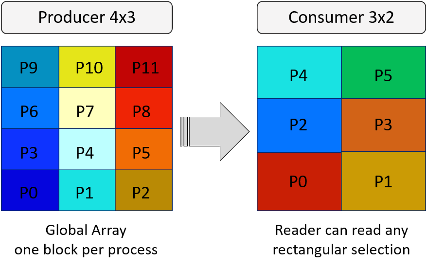

.. _section-variables-global-array:

Global Array
************

ADIOS2 is focusing on writing and reading N-dimensional, distributed, global arrays of primitive types (floats, doubles, integers, complex numbers, chars, etc.). The basic idea is that, usually, a simulation has such a data structure in memory (distributed across multiple processes) and wants to dump its content regularly as it progresses. ADIOS2 was designed

* to do this writing and reading as fast as possible
* to enable reading any subsection of the array 

The figure above shows a parallel application of 12 processes producing a 2D array. Each process has a 2D array locally and the output is created by placing them into a 4x3 pattern. A reading application's individual process then can read any subsection of the entire global array. In the figure, a 6 process application decomposes the array in a 3x2 pattern and each process reads a 2D array whose content comes from multiple producer processes.

The figure hopefully helps to understand the basic concept but it can be also misleading if it suggests limitations that are not there. Global Array is simply a boundary in N-dimensional space where processes can place their blocks of data. In the global space 

* one process can place multiple blocks

  .. image:: ../image/global_array_multiblock.png
     :width: 400

* does NOT need to be fully covered by the blocks

  .. image:: ../image/global_array_sparse.png
     :width: 400

  * at reading, unfilled positions will not change the allocated memory

* blocks can overlap 

  .. image:: ../image/global_array_overlap.png
     :width: 300

  * the reader will get values in an overlapping position from one of the block but there is no control over from which block

* each process can put a different size of block, or put multiple blocks of different sizes

* some process may not contribute anything to the global array

Over multiple output steps

* the processes CAN change the size (and number) of blocks in the array

  * E.g. atom table: global size is fixed but atoms wander around processes, so their block size is changing

    .. image:: ../image/global_array_changing_blocksizes.png
     :width: 400

* the global dimensions CAN change over output steps

  * but then you cannot read multiple steps at once
  * E.g. particle table size changes due to particles disappearing or appearing

    .. image:: ../image/global_array_changing_shape.png
     :width: 400

Limitations of the ADIOS global array concept

* Indexing starts from 0
* Cyclic data patterns are not supported; only blocks can be written or read
* Some blocks's may fully or partially fall outside of the global boundary. The reader will not be able to read those parts

.. note::

   Technically, the content of the individual blocks is kept in the BP format (but not in HDF5 format) and in staging. If you really, really want to retrieve all the blocks, you need to handle this array as a Local Array and read the blocks one by one. 

Defining a global array
=======================

When defining a global array, all processes, that want to contribute, must define the global array with 

* *Name* of the variable as the readers will see it
* *Shape*: a shape (the global boundary, i.e. global size)
* *Count*: the size of the local block and its
* *Start*: position of the local block in the global space 

  .. image:: ../image/global_array.png
     :width: 400

The only fixed information at the point of definition is the name and the number of dimensions. The *Start* and *Count* can be modified later with *SetSelection* before writing a block to the output. This actually needs to be done if one process wants to produce multiple blocks in the array. The *Shape* of the array can be modified up to the point of the last *Put* call in the output step but the final shape must be the same on every producer. 

